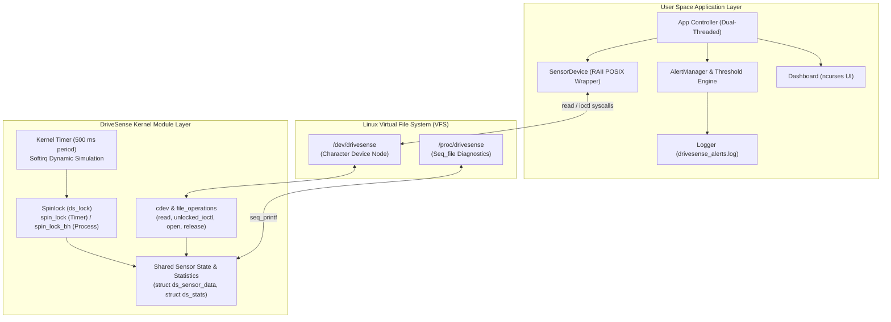
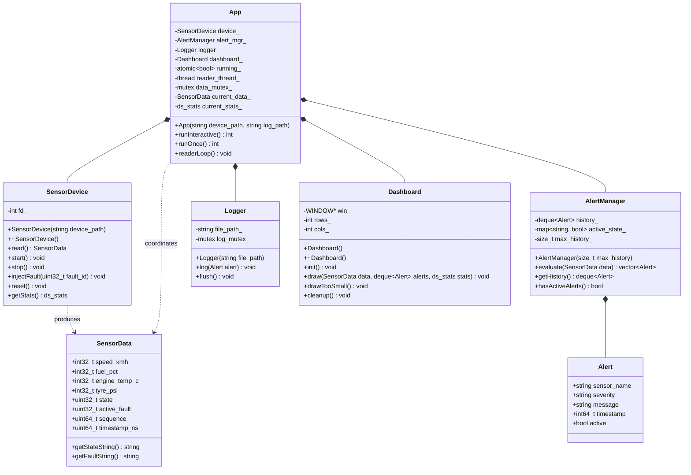
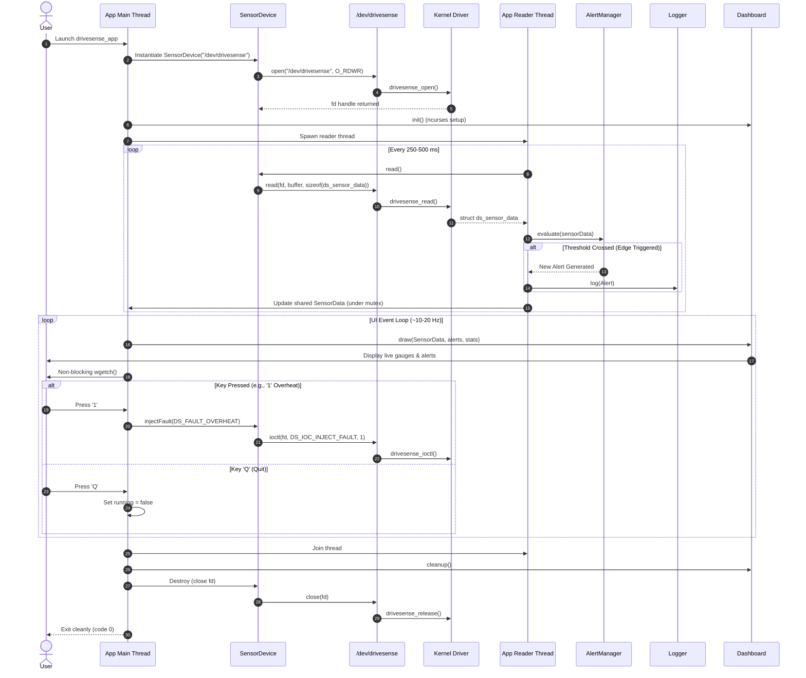
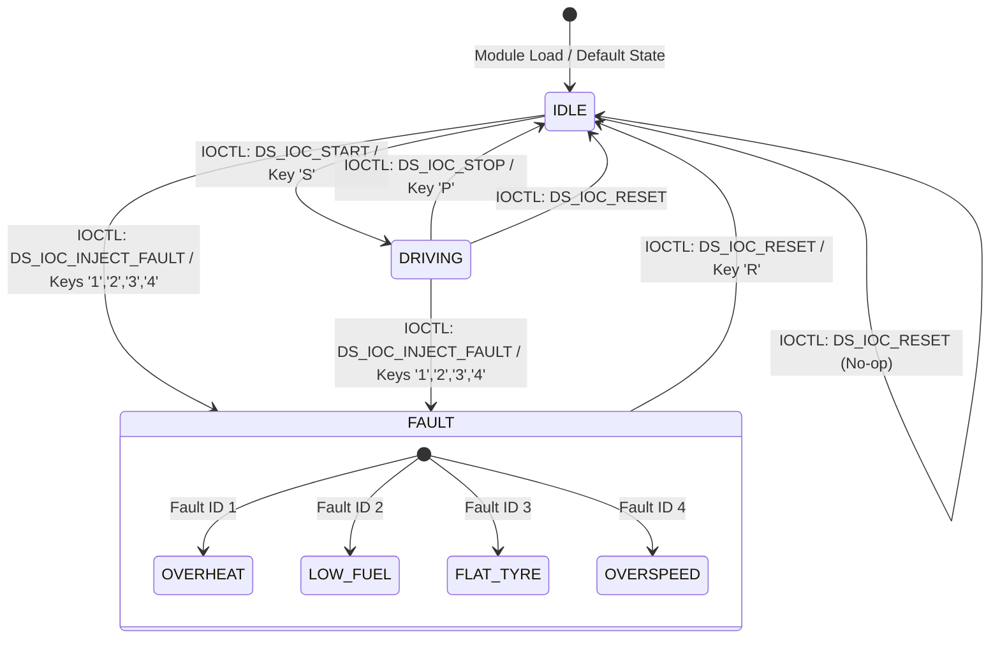

# DriveSense — Stage 3: System Architecture, Data Design & UML Specifications

## 1. System Architecture Overview

DriveSense is architected around a strict three-tier decoupled model that isolates simulated hardware dynamics in kernel space from user interface presentation and diagnostic logic in user space.



### Architecture Layers:
1. **User Space Application Tier:** A modern C++17 multi-threaded application. A background worker thread performs non-blocking synchronous reads from `/dev/drivesense`, normalizes telemetry, checks safety thresholds via `AlertManager`, dispatches disk logging, and updates shared memory. The main thread drives an interactive `ncurses` UI rendering live gauge bars and listening for keyboard controls.
2. **VFS Device Interface Tier:** Standard Linux VFS abstractions exposing `/dev/drivesense` (character device major/minor allocation) and `/proc/drivesense` (read-only diagnostic file).
3. **Kernel Driver Tier:** A loadable Linux kernel module managing simulated vehicle physics. An autonomous kernel timer (500 ms / 2 Hz period) updates internal vehicle state under a dedicated spinlock (`spinlock_t`), guaranteeing concurrency safety against user space `read()` and `ioctl()` calls.

---

## 2. Component Responsibilities

| Component | Execution Context | Core Responsibilities |
| :--- | :--- | :--- |
| `drivesense.ko` | Linux Kernel Space | Allocates chrdev region, creates device node, executes 500 ms softirq simulation timer, synchronizes state via spinlock, handles `read()`, `ioctl()`, and `/proc` generation. |
| `SensorDevice` | User Space (C++) | RAII lifecycle management of `/dev/drivesense` file descriptor; safe wrappers for `read()`, `start()`, `stop()`, `injectFault()`, `reset()`, and `getStats()`. |
| `SensorData` | User Space (C++) | Immutable telemetry snapshot conversion from C `struct ds_sensor_data` into C++ friendly abstractions with string helper lookups. |
| `AlertManager` | User Space (C++) | Pure business logic engine evaluating sensor readings against threshold boundaries; maintains edge-triggered state (no repeat spam) and alert history ring. |
| `Logger` | User Space (C++) | Thread-safe, persistent file sink writing formatted warning notices with timestamps to `drivesense_alerts.log`. |
| `Dashboard` | User Space (C++) | Terminal UI view using `ncurses`; formats numerical gauges, progress bars, color codes (green OK, red WARN), and detects terminal resize limits. |
| `App` | User Space (C++) | Orchestrates thread lifecycle (background telemetry reader and foreground rendering), handles OS signals (SIGINT, SIGTERM), and dispatches CLI options. |

---

## 3. Data Structures & Protocol Definitions

### Telemetry Packet (`struct ds_sensor_data`)
Shared between kernel and user space via `include/drivesense_ioctl.h`:
```c
struct ds_sensor_data {
    __s32 speed_kmh;       /* 0..200 km/h */
    __s32 fuel_pct;        /* 0..100 % */
    __s32 engine_temp_c;   /* 20..130 deg C */
    __s32 tyre_psi;        /* 0..40 PSI */
    __u32 state;           /* enum ds_state: 0=IDLE, 1=DRIVING, 2=FAULT */
    __u32 active_fault;    /* enum ds_fault: 0=NONE, 1=OVERHEAT, 2=LOW_FUEL, 3=FLAT_TYRE, 4=OVERSPEED */
    __u64 sequence;        /* Monotonically increasing counter per timer tick */
    __u64 timestamp_ns;    /* ktime_get_ns() captured at update time */
};
```

### Driver Statistics (`struct ds_stats`)
```c
struct ds_stats {
    __u64 reads;           /* Total read() syscall count */
    __u64 ioctls;          /* Total ioctl() syscall count */
    __u64 updates;         /* Total timer simulation cycles */
    __u64 faults_injected; /* Total faults triggered */
    __u32 open_count;      /* Number of currently open file handles */
};
```

### IOCTL Command Specification
Magic character identifier: `'D'` (`0x44`).

| IOCTL Command | Direction & Type | Arguments | Description |
| :--- | :--- | :--- | :--- |
| `DS_IOC_START` | `_IO(DS_MAGIC, 1)` | None | Transitions vehicle from IDLE to DRIVING (if not in FAULT). |
| `DS_IOC_STOP` | `_IO(DS_MAGIC, 2)` | None | Transitions vehicle from DRIVING to IDLE. |
| `DS_IOC_INJECT_FAULT` | `_IOW(DS_MAGIC, 3, __u32)` | `__u32` Fault ID | Injects fault (1=OVERHEAT, 2=LOW_FUEL, 3=FLAT_TYRE, 4=OVERSPEED); sets state to FAULT. |
| `DS_IOC_RESET` | `_IO(DS_MAGIC, 4)` | None | Restores baseline values (Speed 0, Fuel 80, Temp 70, Tyres 32, State IDLE, Fault NONE). |
| `DS_IOC_GET_STATS` | `_IOR(DS_MAGIC, 5, struct ds_stats)` | `struct ds_stats*` | Copies internal operational statistics to user buffer. |
| `DS_IOC_GET_DATA` | `_IOR(DS_MAGIC, 6, struct ds_sensor_data)` | `struct ds_sensor_data*` | Copies current telemetry snapshot to user buffer. |

---

## 4. Safety Thresholds & Alarm Criteria

| Sensor Channel | Normal Operating Range | Warning Limit | Severity | Trigger Condition | Clear Condition |
| :--- | :--- | :--- | :--- | :--- | :--- |
| **Speed** | 0 – 120 km/h | **> 120 km/h** | WARNING | Speed exceeds 120 km/h | Speed drops ≤ 120 km/h |
| **Fuel Level** | 10 – 100 % | **< 10 %** | CRITICAL | Fuel drops below 10 % | Fuel rises ≥ 10 % |
| **Engine Temp** | 70 – 105 °C | **> 105 °C** | CRITICAL | Temperature exceeds 105 °C | Temperature drops ≤ 105 °C |
| **Tyre Pressure**| 30 – 35 PSI | **< 26 PSI** | WARNING | Pressure falls below 26 PSI | Pressure recovers ≥ 26 PSI |

---

## 5. UML Diagrams

### 5.1 Class Diagram



### 5.2 Sequence Diagram



### 5.3 State Diagram



---

## 6. Implementation & Verification Plan

### Development Environment (Verified in Phase 0)
- **Host / VM:** Ubuntu 24.04.5 LTS (Noble Numbat)
- **Linux Kernel:** `7.0.0-38-generic` (x86_64)
- **C/C++ Compiler:** GCC / G++ 13.3.0 (`-std=c++17`, `-Wall -Wextra -Wpedantic`)
- **Build System:** GNU Make (Kernel Kbuild) and CMake 3.28.3 (Application & Tests)
- **Libraries:** GNU Libncurses (`libncurses-dev`), POSIX Threads (`pthread`)
- **Static Analysis:** Cppcheck 2.13.0
- **Version Control:** Git 2.43.0

### Git Branching Model
```
main (v1.0 release tag)
  ^
  |-- develop (integration line)
        ^
        |-- feature/docs       (Phases 1 & 2)
        |-- feature/driver     (Phase 3)
        |-- feature/dashboard  (Phase 4)
        |-- feature/testing    (Phase 5)
```
Each stage is developed on its dedicated feature branch, thoroughly verified against automated tests, merged into `develop` with `--no-ff`, and finally merged into `main` with annotated release tags.
